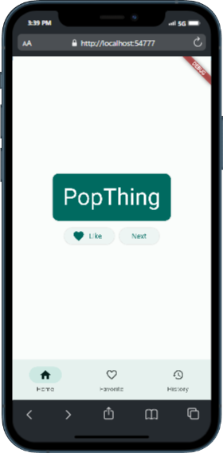

# flutter_random_wise_word

## Features
1. **Random Word Generator**: Generates a random word pair on the Home Page.
2. **Favorites Page**: Allows users to save and view a list of favorite words.
   - Long-pressing a word in the list removes it from favorites.
3. **History Page**: Keeps track of all words generated and provides a "Clear All History" button to reset the list.

## Screenshots and Details

### Home Page
This is the main page where you can generate random word pairs and save them to your favorites.

### Favorites Page
- The favorites list will appear when you click the "Like" button to save a word.
  
  

- This is the list of words saved to your favorites.

  

- You can tap on any word in the favorites list to display the word in a snackbar.
  
  

- Long-pressing a word in the favorites page will remove it from the list.

  

### History Page
- The History page shows a list of all the words generated from the Home Page by clicking "Next."

  

- Pressing "Clear All History" removes all words from the history list.

  

---

